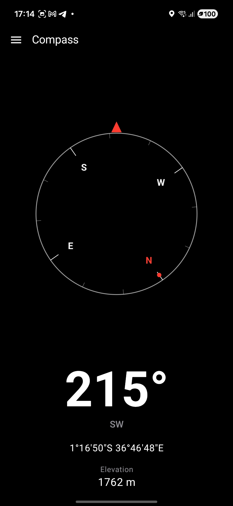
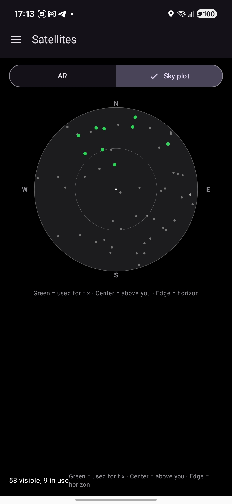
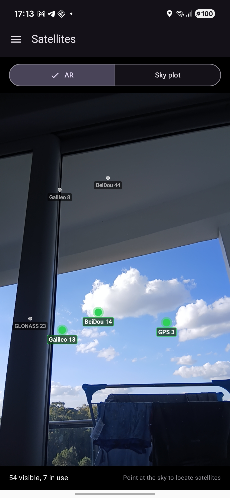

# Compass

A portrait-orientation Android compass and GPS utility built with Kotlin and Jetpack Compose. The app shows a live heading, position, and elevation, with optional screens for satellite tracking, bearing to a map target, and GPX trail recording.

## Screenshots

### Compass
Live heading, cardinal direction, coordinates in DMS, and elevation.



### Satellites
GNSS sky plot and AR overlay on the camera feed. In-fix satellites are highlighted in green.

| Sky plot | AR view |
| --- | --- |
|  |  |

## Features

### Compass
- Live magnetic heading with cardinal direction
- Tilt-compensated heading that works when the phone is flat on a table or held upright in portrait
- Animated compass dial with degree ring, cardinal labels, and north indicator
- Figure-8 magnetometer calibration (drawer → **Calibrate Compass**)

### Location
- Latitude and longitude in degrees/minutes/seconds
- Elevation from GPS
- Speed shown below elevation when moving above 1 m/s (tap to switch km/h and m/s)
- GPS fix status
- Satellite-in-fix count in the app bar when GNSS is tracking

### Satellites
- GNSS satellite count, signal strength, and fix usage
- Sky plot showing azimuth and elevation relative to the device heading
- AR view that overlays visible satellites on the camera feed (in-fix satellites highlighted)

### Bearing to target
- Pick a point on an OpenStreetMap map
- Shows bearing and distance to the selected coordinate

### Trail
- Record breadcrumbs at configurable intervals
- View the trail on a map with numbered markers
- Export and load GPX files

## Requirements

| | |
|---|---|
| **Language** | Kotlin |
| **UI** | Jetpack Compose, Material 3 |
| **Min SDK** | 35 (Android 15) |
| **Target SDK** | 36 |
| **JDK** | 17 |
| **Tested device** | Samsung Galaxy A16 |

The app targets recent Android releases only (the last two major versions at time of development).

## Permissions

- **Location** — heading support, coordinates, GNSS status, trail recording
- **Camera** — satellite AR overlay
- **Internet** — map tiles (OSMDroid)

## Architecture

- **UI** — Compose screens with a navigation drawer (`Compass`, `Calibrate Compass`, `Satellites`, `Bearing to Target`, `Trail`)
- **State** — `CompassViewModel` with provider interfaces for compass, location, orientation, and satellites
- **DI** — `AppContainer` wires concrete Android providers and domain helpers
- **Domain logic** — pure Kotlin where possible (`CompassHeadingCalculator`, `BearingCalculator`, `GpxParser`, AR projection, formatters, magnetometer calibration)
- **Tests** — unit tests for domain and data layers; run before committing changes

### Compass heading

Heading is derived from accelerometer + magnetometer fusion when both sensors are available. This gives stable results in portrait and when the phone lies flat. On devices that expose only `TYPE_GEOMAGNETIC_ROTATION_VECTOR` (such as the Galaxy A16), the rotation vector is used as a fallback. A low-pass heading smoother reduces jitter when the device is stationary. Optional figure-8 calibration stores hard- and soft-iron correction for the magnetometer.

## Build and run

```bash
export JAVA_HOME=/opt/homebrew/opt/openjdk@17   # adjust for your system
export ANDROID_HOME="$HOME/Library/Android/sdk"

./gradlew :app:test
./gradlew :app:assembleDebug
adb install -r app/build/outputs/apk/debug/app-debug.apk
```

Release builds:

```bash
./gradlew :app:assembleRelease
```

## Project layout

```
app/src/main/java/compass/
  data/       Android sensor, location, and GNSS providers
  domain/     Heading, bearing, GPX, satellite AR, formatters
  provider/   Interfaces for testable boundaries
  ui/         Compose screens, components, navigation, theme
  di/         AppContainer dependency wiring
docs/         Screenshots for the README
```

## License

See repository for license details.
